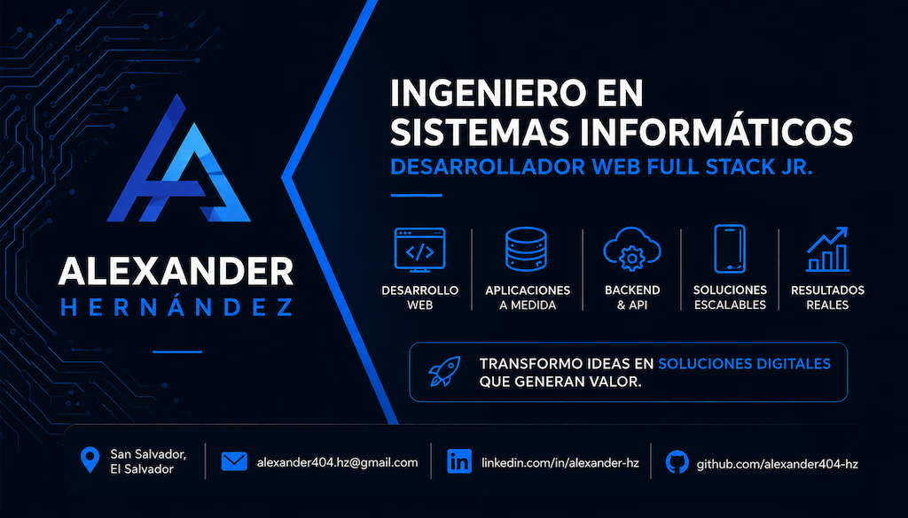

# Portafolio | Alexander Hz.

Portafolio web personal de **Alexander Hernandez**, Ingeniero en Sistemas Informáticos y Desarrollador Web Full Stack Jr. Este sitio presenta mi perfil profesional, proyectos desarrollados, habilidades técnicas y medios de contacto.

🔗 **Sitio en vivo:** [alexander404-hz.github.io/Portafolio](https://alexander404-hz.github.io/Portafolio/)

📸 Agrega aquí una captura de pantalla del sitio:



## ✨ Características

- **Landing page de una sola página** con navegación por anclas (`Inicio`, `Sobre mí`, `Proyectos`, `Habilidades`, `Contacto`).
- **Sección "Sobre mí"** con foto, resumen profesional, CV descargable en PDF y valores personales.
- **Galería de proyectos** con tarjetas expandibles (mostrando tecnologías usadas, aprendizajes y enlaces a demo/código).
- **Sección de habilidades** con barras de progreso por tecnología (HTML, CSS, JS) y apartado de "actualmente aprendiendo".
- **Formulario de contacto funcional** integrado con [Formspree](https://formspree.io/), con validaciones nativas de HTML5.
- **SEO y Open Graph** configurados (meta tags, Twitter Card, canonical URL) para mejor indexación y vista previa en redes sociales.
- **Optimización de rendimiento**: carga diferida de fuentes de Google Fonts, `preconnect`, imágenes con `loading="lazy"` y `fetchpriority`.
- **Accesibilidad (A11y)**: uso semántico de `fieldset`/`legend`, atributos `aria-label`, `alt` descriptivos y navegación accesible.
- Botón de **"volver arriba"** (back to top).

## 🛠️ Tecnologías

- **HTML5** — Estructura semántica y accesible.
- **CSS3** — Metodología BEM, diseño Mobile First, layouts responsivos.
- **JavaScript** — Interactividad (menú, formulario, proyectos expandibles, back to top).
- **Google Fonts** (Poppins) — Tipografía.
- **Formspree** — Manejo del formulario de contacto sin backend propio.

## 📁 Estructura del proyecto

```
Portafolio/
├── index.html
├── favicon.ico
├── site.webmanifest
├── assets/
│   ├── css/
│   │   └── styles.css
│   ├── js/
│   │   └── app.js
│   ├── img/
│   │   ├── foto-alexander.webp
│   │   ├── preview.png
│   │   └── ...
│   ├── icons/
│   │   ├── favicon.svg
│   │   ├── favicon-32x32.png
│   │   └── favicon-16x16.png
│   └── docs/
│       └── curriculum-vitae-alexander-hernandez.pdf
└── proyectos/
    ├── formulario.html
    └── multimedia.html
```

## 🚀 Cómo verlo localmente

1. Clona el repositorio:
   ```bash
   git clone https://github.com/Alexander404-hz/Portafolio.git
   ```
2. Entra a la carpeta del proyecto:
   ```bash
   cd Portafolio
   ```
3. Abre `index.html` directamente en tu navegador, o usa una extensión como **Live Server** (VS Code) para servirlo localmente.

No requiere instalación de dependencias ni build steps: es un sitio estático (HTML, CSS y JS puro).

## 📌 Proyectos destacados

| Proyecto | Descripción | Tecnologías |
|---|---|---|
| [Landing Page - Contabilidad Florez](https://alexander404-hz.github.io/Landing-Page-Contabilidad/) | Landing page de servicios contables enfocada en jerarquía visual y navegación intuitiva. | HTML5, CSS3 |
| Formulario de registro con validaciones | Formulario con validaciones nativas HTML5 (`required`, `pattern`, `min`/`max`) y buenas prácticas de accesibilidad. | HTML5, CSS3, JS |
| Contenido Multimedia y Responsive | Uso de `srcset`, `sizes` y `picture` para imágenes adaptativas y contenido multimedia optimizado. | HTML5, CSS3 |

## 📫 Contacto

- **GitHub:** [@Alexander404-hz](https://github.com/Alexander404-hz)
- **Email:** [alexander404.hz@gmail.com](mailto:alexander404.hz@gmail.com)
- **LinkedIn:** [/in/Alexander-hz](https://www.linkedin.com/in/alexander-hz/)

## 📄 Licencia

© 2026 Alexander Hz. Todos los derechos reservados.